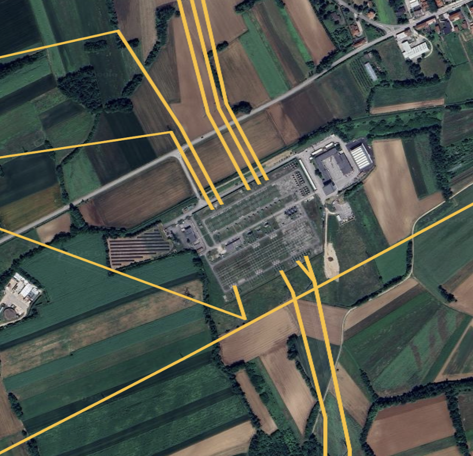
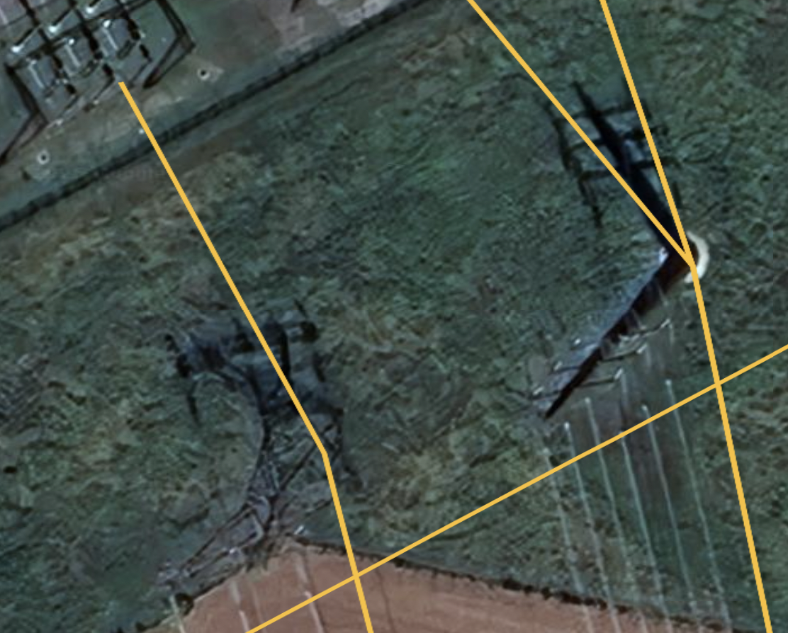
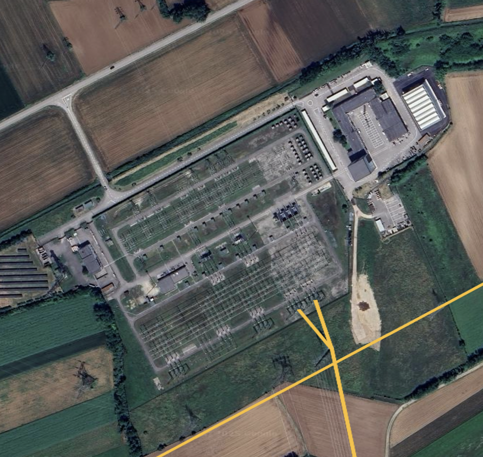
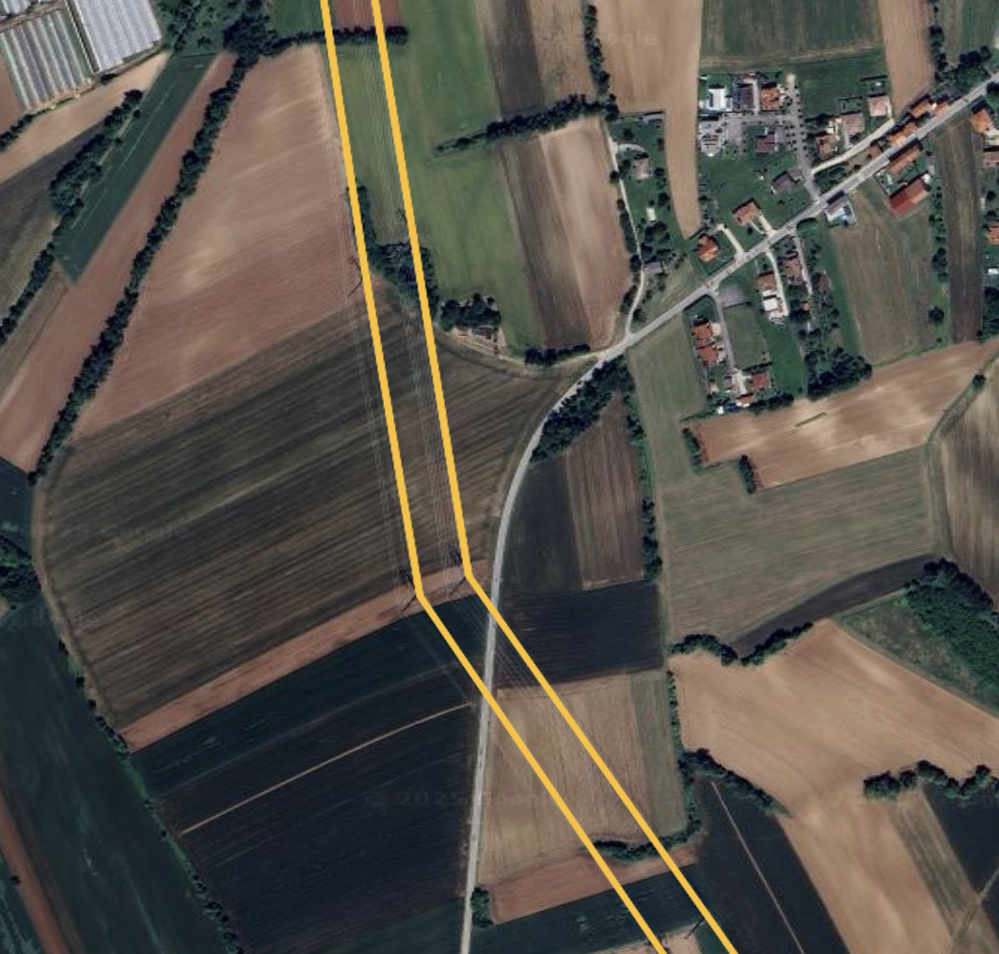
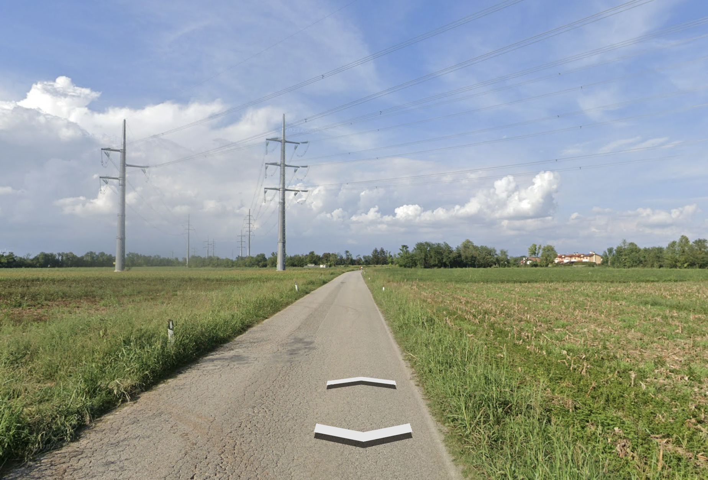
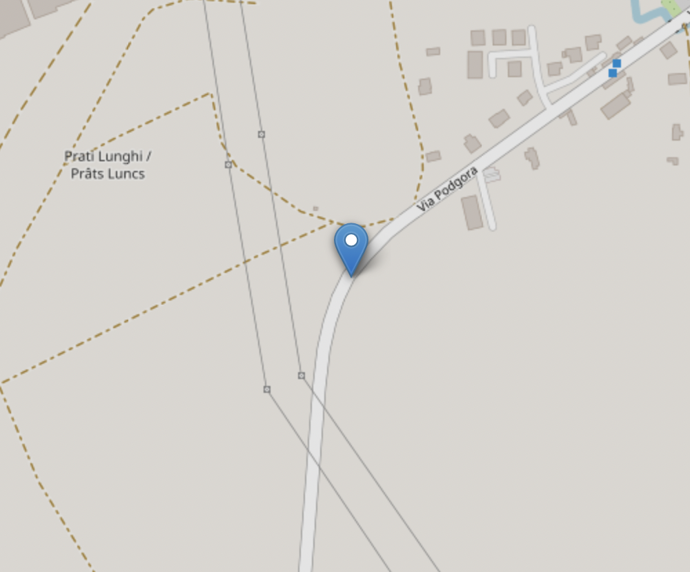

## CTF Writeup: "Geoguesser"

### Challenge Description

In this challenge, a short video clip shows a man driving through a rural area surrounded by cornfields. During the drive, two key details stand out:

### Video Hints and Map Constraints

1. At one point, **two parallel high-voltage powerlines** cross the road.
2. Immediately after the crossing, the road takes a **right-hand turn**.

The goal is to determine the exact location where the video was recorded. The CTF website provides a map interface where the precise location must be **clicked within an accuracy of 80 meters**.

The map has a fixed zoom level, showing the following bounding box as its limits:

* **West boundary:** Cortina d’Ampezzo
* **North boundary:** Bad Bleiberg
* **East boundary:** Idrija
* **South boundary:** Trieste

This restricts the possible search area to the **Friuli Venezia Giulia region** in northeastern Italy.

---

### Step 1: Extract all powerline-road crossings

Because the location involves **high-voltage powerlines crossing a road**, gather all such intersections within the search area using [Overpass Turbo](https://overpass-turbo.eu/).

Paste the following query into Overpass Turbo:

```
[out:json][timeout:120];
// Friuli Venezia Giulia bounding box: south,west,north,east
(
  way(45.58,12.3202,46.6469,13.9182)[power=line];
)->.powerlines;

node(w.powerlines)->.pylon_nodes;

// Only highways that cross those powerlines
way(bn.pylon_nodes)[highway~"^(primary|secondary|tertiary|residential)$"]->.crossing_roads;

// Output the lines + crossing roads
(.powerlines; .crossing_roads;);
out geom;
```

This script does the following:

* Select all **powerlines** within the Friuli Venezia Giulia bounding box.
* Collect all **nodes** where powerlines have pylons.
* Filter for **roads** that intersect these nodes, focusing on primary, secondary, tertiary, or residential roads.
* Output both the **powerlines** and the **crossing roads** for visualization.


Run the query, then click **Export → KML** to download the data. Open the KML file in **Google Earth** for satellite inspection.

---

### Step 2: Narrow the search area using clues

Use the video clues to narrow down the area:

1. Focus on regions dominated by **cornfields**, which are common near **Udine**.
2. Identify areas where **two parallel powerlines** exist.
3. Look for roads with a **right-hand turn immediately after the crossing**.

Concentrate on Udine and its surroundings because the combination of cornfields, powerlines, and road layout makes it the most likely area.

---

### Step 3: Use Google Earth to pinpoint the location

With the KML data loaded in Google Earth, follow these steps:

1. Identify **a high-voltage substations** near Udine, as most major powerlines originate there.



2. Compare the shadows of the pylons originating from the substation with the pylons in the video and eliminate any lines where the pylons do not match.

<p float="left">
  
  
</p>

3. Trace each powerline along its path, searching for stretches where **two lines run parallel** and find locations where these **parallel lines cross a road**.



4. Check the road at each crossing for a **right-hand turn immediately afterward**, matching the video.
5. Compare the surrounding terrain with the video: look for **cornfields, road type, and the angle of the turn**.



Once all conditions match, the exact spot is identified.

---

### Step 4: Submit the location

After identifying the correct location, **return to the CTF map** and click on the coordinates where the powerlines cross the road and the right-hand turn occurs. Ensure the placement is **within 80 meters accuracy**.



---

### Conclusion

By combining **OSM data from Overpass Turbo**, **Google Earth satellite imagery**, and observation of the **video clues**, it is possible to narrow the search area from an entire region to a single road crossing.